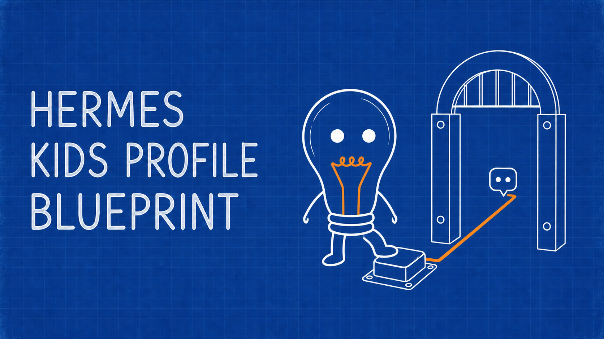

# Hermes Kids Profile Blueprint



A parent-operated starter kit for designing a private, child-facing [Hermes Agent](https://hermes-agent.nousresearch.com/docs) profile.

Clone or download this repository, start a trusted adult Hermes agent from the repository directory, and send it one short instruction:

```text
I'd like your help designing a private, child-facing Hermes profile. This
repository is a parent-operated starter kit with the process and templates.
Please read START-HERE.md and follow its instructions.
```

The agent will inspect the installed Hermes release, interview the parent, propose a private profile, and test the result in the interface the child will use. The full, versioned setup instructions live in [`START-HERE.md`](START-HERE.md), so the handoff stays short and the process can improve without changing the prompt.

## What this repository provides

- a short bootstrap instruction backed by a versioned setup playbook;
- a child-neutral `SOUL.md` starting point;
- seed formats for `USER.md` and `MEMORY.md`;
- an adaptive parent decision guide;
- guidance for optional workspace context, skills, and extensions;
- a privacy-aware memory review process;
- scenario-based evaluation and maintenance guides;
- one synthetic example.

## What it does not provide

This repository is not an installable Hermes profile. It does not contain a universal `config.yaml`, credentials, child data, or a security certificate.

A Hermes profile separates Hermes state. It does not create an operating-system sandbox. A local Hermes process can have the same access as the operating-system account that runs it. `SOUL.md` guides model behavior, but it does not enforce tool, filesystem, credential, network, or account boundaries.

The setup agent must inspect the current Hermes documentation and resolved runtime before it makes claims about isolation or access.

## Design principles

- **Reuse knowledge, not trust boundaries.** A parent agent may know useful family context. Transfer only information that the parent reviews and approves for the child profile.
- **Start fresh and non-cloned.** Do not use `--clone`, `--clone-all`, or `--clone-from`. Use `--no-skills` when supported, then add only individually approved skills. A normal fresh profile may still seed bundled skills.
- **Start with the least capability.** Add only what the parent approves. Test the resolved tools and the real child-facing interface.
- **Control data by destination.** Model processing is part of ordinary chat. Search, media, speech, messaging, forms, and public posting are separate data flows. Minimize each one, and block public or unrelated disclosure by default.
- **Tune behavior with examples.** Begin with the warm, grounded default in `SOUL.md.seed`. Show response samples, revise them with the parent, and test the final profile against the approved samples.
- **Keep evidence honest.** Report what passed, failed, and remains unverified. Repository lint or a model's promise is not proof of runtime enforcement.
- **Match isolation to access.** Profiles and in-process controls are not containment. Independent child access or untrusted input requires an approved OS-level boundary, or the build remains not ready.

## File map

- [`START-HERE.md`](START-HERE.md): setup-agent instructions and build sequence
- [`SOUL.md.seed`](SOUL.md.seed): default relationship and behavior language
- [`USER.md.seed`](USER.md.seed): child profile context format
- [`MEMORY.md.seed`](MEMORY.md.seed): agent operational-memory format
- [`DECISIONS.md`](DECISIONS.md): adaptive interview domains and tradeoffs
- [`MEMORY-REVIEW.md`](MEMORY-REVIEW.md): parent-approved context transfer
- [`EVALS.md`](EVALS.md): real-interface evaluation scenarios
- [`MAINTENANCE.md`](MAINTENANCE.md): review triggers and update process
- [`EXAMPLE.md`](EXAMPLE.md): synthetic design summary
- [`STYLE.md`](STYLE.md): repository writing rules

## Current Hermes references

The setup agent should open the current documentation rather than rely on a frozen copy:

- [Profiles](https://hermes-agent.nousresearch.com/docs/user-guide/profiles)
- [Configuration](https://hermes-agent.nousresearch.com/docs/user-guide/configuration)
- [Memory](https://hermes-agent.nousresearch.com/docs/user-guide/features/memory)
- [Profile commands](https://hermes-agent.nousresearch.com/docs/reference/profile-commands)
- [Tools](https://hermes-agent.nousresearch.com/docs/reference/tools-reference)
- [Slash commands](https://hermes-agent.nousresearch.com/docs/reference/slash-commands)
- [Security](https://hermes-agent.nousresearch.com/docs/user-guide/security)

## Private data

Do not commit generated profiles, child or family data, credentials, session exports, evaluation transcripts, or build reports to this repository. Build the private profile outside the repository.

## License

MIT. See [`LICENSE`](LICENSE).
